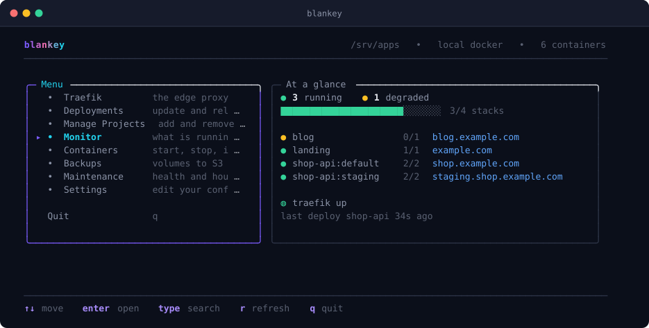
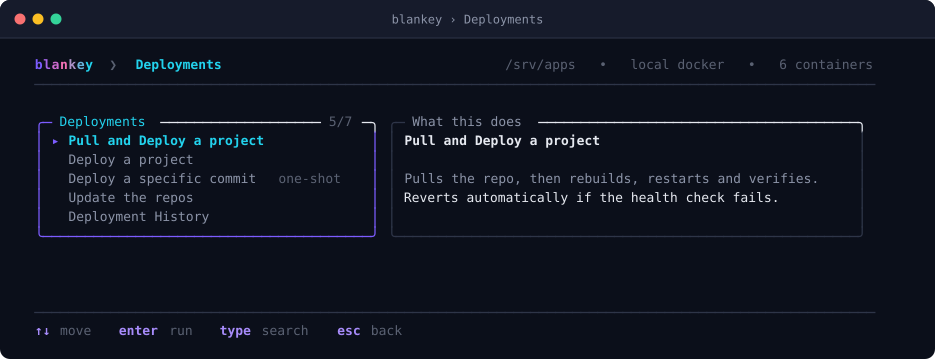
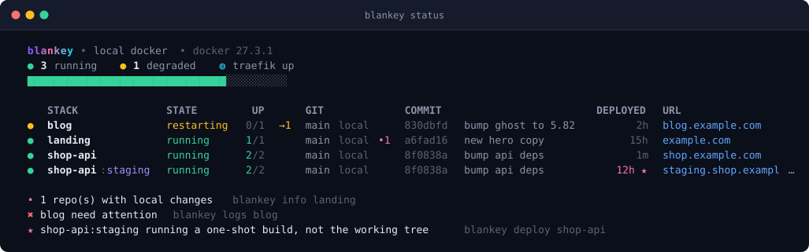
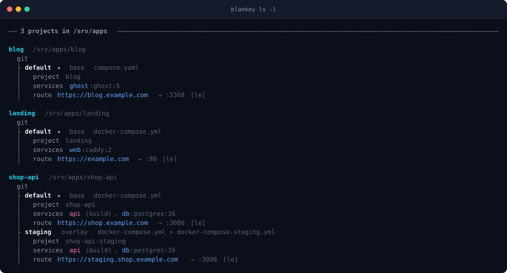
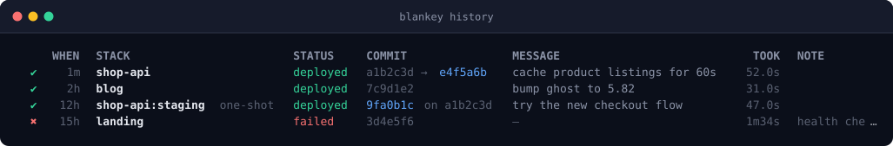
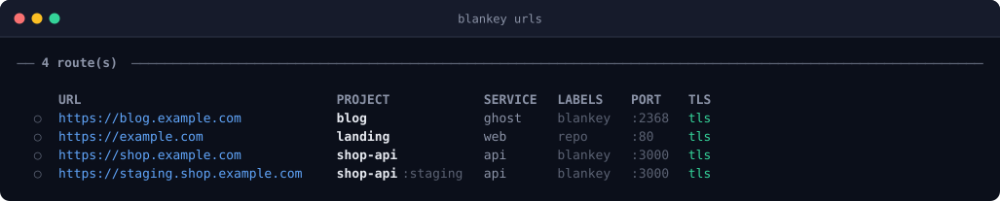
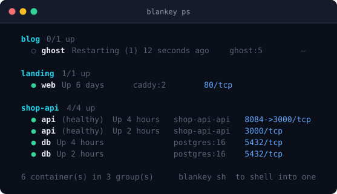
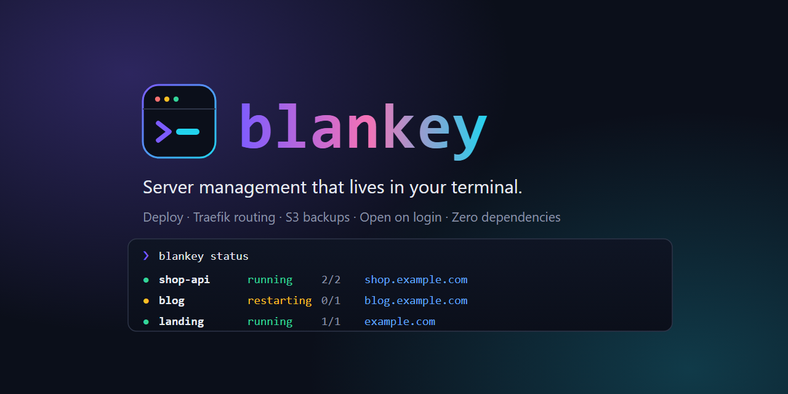

<p align="center">
  
</p>

<p align="center">
  <strong>Server management that lives in your terminal.</strong><br>
  Deploy, route, back up and inspect a fleet of Docker Compose apps, over SSH, with your keyboard.
</p>

<p align="center">
  
  
  
  
  
  
</p>

<p align="center">
  
</p>

---

Think **Dokploy** or **Coolify**, without the browser and without the moving parts. blankey is one
command on the box: no daemon, no database, no agent, no web server, no runtime dependencies.

Point it at the folder where your repos live. It finds every project, every compose file inside them
(including `docker-compose.staging.yml` and friends), and gives you one way to update, redeploy,
inspect, pin or roll back any of them, all behind a single Traefik proxy it can set up for you.

Set it to open on login, and **SSH-ing into the server _is_ the control panel.**

```sh
blankey                            open the menu
blankey status                     live view of every stack
blankey deploy --all --changed     redeploy only repos with new commits
blankey deploy shop-api --at v1.4  run one commit, then put the repo back
blankey backup --all               archive every volume to S3
blankey clean                      what disk you would get back, no changes
```

### Why it exists

A PaaS gives you a nice UI and takes ownership of your deployments in return: its own database, its
own idea of what an app is, its own thing to keep running and upgrade. blankey does the opposite:

- **Your compose files stay the source of truth.** Nothing is imported or wrapped. Uninstall blankey
  and your stacks keep running exactly as they are.
- **State is two files on disk.** A config file, and a deploy log next to your projects. That is all.
- **It works over SSH.** Drive a server from your laptop with the same commands.
- **Nothing to keep alive.** It runs when you run it.

---

## Contents

- [Install](#install) · [First run](#first-run) · [Open on login](#open-on-login) · [Updates](#staying-up-to-date)
- [The interactive program](#the-interactive-program)
- **Deploying**: [the pipeline](#the-deploy-pipeline) · [updating](#updating-without-deploying) · [pinning and rollback](#pinning-and-rolling-back) · [one-shot deploys](#one-shot-deploys)
- **Routing**: [Traefik](#traefik) · [routing without touching the repo](#routing-without-touching-the-repo) · [SSL configurations](#ssl-configurations)
- **Operating**: [containers and shells](#containers-and-shells) · [logs](#logs) · [backups](#backups) · [reclaiming disk](#reclaiming-disk) · [doctor](#doctor)
- **Reference**: [how discovery works](#how-discovery-works) · [per-repo config](#per-repo-configuration) · [commands](#command-reference) · [configuration](#configuration-reference)
- [Contributing](#contributing) · [Licence](#licence)

---

## Install

```sh
curl -fsSL https://raw.githubusercontent.com/matpulis/blankey/main/install.sh | sh
```

That is the whole thing, on **any Linux distribution**. It installs Node if the box does not have a
new enough one, builds blankey, and puts it on `PATH`.

To have it open every time you log in, add `--autostart`. Piped into `sh`, flags need `-s --` in
front of them:

```sh
curl -fsSL https://raw.githubusercontent.com/matpulis/blankey/main/install.sh | sh -s -- --autostart
```

<details>
<summary><strong>Rather read it before you run it?</strong></summary>

Piping a remote script into `sh` runs whatever happens to be at that URL, as you, with `sudo` where
it needs root. That deserves a minute of scepticism on any project, including this one:

```sh
curl -fsSL https://raw.githubusercontent.com/matpulis/blankey/main/install.sh -o install.sh
less install.sh              # ~410 lines of POSIX sh, no minification, no base64
sh install.sh --dry-run      # says exactly what it would do, changes nothing
sh install.sh
```

`--dry-run` works through the pipe too, and prints where the source would come from, which Node it
would use and whether it would need `sudo`:

```sh
curl -fsSL .../install.sh | sh -s -- --dry-run
```
</details>

Or clone it and install from the checkout, which is also what you want for hacking on it:

```sh
git clone https://github.com/matpulis/blankey.git /opt/blankey
sh /opt/blankey/install.sh
```

It handles Debian/Ubuntu, RHEL/Fedora/CentOS, Alpine, Arch, openSUSE, Void and Gentoo, and mostly
does not care which it is on. Node comes from the official build for your architecture, except on
musl systems (Alpine), where the distribution's own package is the only one that will run.

| flag | |
|---|---|
| `--from <src>` | install from a git URL, a `.tar.gz` URL, or a local checkout |
| `BLANKEY_REPO` | env: where to clone from when the script is not inside a checkout |
| `--ref <name>` | branch or tag to install, when fetching the source |
| `--autostart` | open blankey on login once installed |
| `--kiosk` | with `--autostart`, quitting blankey ends the session |
| `--prefix <dir>` | where Node goes if it has to be installed (default `/usr/local`) |
| `--skip-node` | assume the installed Node is fine |
| `--dry-run` | say what would happen, change nothing |

Pin an install to a release with `--ref`, which is the sane thing to do on a server you care about:

```sh
curl -fsSL .../install.sh | sh -s -- --ref v0.1.0
```

**Requirements on the box:** `docker`, `git` and `curl`. Node 18.17+ is installed for you if missing.

<details>
<summary><strong>Installing by hand</strong></summary>

```sh
cd /opt/blankey
npm install     # installs TypeScript and builds to dist/ via the prepare script
npm link        # gives you `blankey` and the short alias `bk`
```

blankey is TypeScript compiled ahead of time, with **no runtime dependencies**: only `typescript`
to build. The installed tool needs nothing but Node, `docker`, `git` and `curl`.
</details>

## First run

Run `blankey`. With no configuration it walks you through the few things it genuinely cannot guess,
then writes a commented config file. It is short on purpose. **Three questions** if you skip backups:

1. **Where your repos live**: the folder holding one directory per project
2. **Whether Docker is local or reached over SSH**
3. **Off-site backups**: which storage provider, if any

Hostnames and TLS are deliberately *not* asked. Each project declares its own hostname later, so
there is nothing useful to answer up front.

The wizard branches on what you answer. Choose "Not now" for backups and it stops asking: no
region, no bucket, no keys. Choose Hetzner or DigitalOcean and it asks for the region and bucket,
listing only *that* provider's regions. `esc` walks back a question at a time, and nothing is written
until the last screen.

For scripted setup, `blankey init` does the same thing non-interactively:

```sh
blankey init --projects-dir /srv/apps --domain example.com --email me@example.com -y
```

## Open on login

`blankey autostart enable` makes an SSH session drop straight into the program.

```sh
blankey autostart enable                      # for you
sudo blankey autostart enable --system        # for everyone on the box
blankey autostart enable --kiosk --ssh-only   # an operator account that only ever sees blankey
blankey autostart status                      # where it is set up
blankey autostart disable                     # put the login file back
```

It adds one guarded block to the file your login shell actually reads: `/etc/profile.d/` for
`--system`, otherwise whichever of `~/.bash_profile`, `~/.bash_login`, `~/.profile` or `~/.zprofile`
your shell reads (fish gets `conf.d/blankey-autostart.fish`). `disable` removes exactly that block
and leaves the rest of the file untouched.

Without `--kiosk`, quitting blankey drops you at your normal shell. With it, quitting ends the
session, which is the point for an account that should only ever see blankey.

### You cannot lock yourself out

This is the one part of a server you can genuinely shut yourself out of, so the escape hatch is
**structural**, not a setting you have to have remembered to turn on.

Login files run for interactive login shells only. Giving SSH a command bypasses them entirely, so
this works no matter how badly blankey is broken:

```sh
ssh user@host bash        # a plain shell, every time
```

On top of that, the block refuses to run unless it is an interactive shell with a real terminal on
both ends and `blankey` is actually on `PATH`, so `scp`, `sftp` and `rsync` are unaffected, and a
half-finished install does nothing rather than failing on login. `BLANKEY_NO_AUTOSTART=1` skips it
for one session, and `BLANKEY_ACTIVE` (which blankey sets for everything it launches) stops a shell
opened *from inside* blankey opening blankey again.

`blankey autostart print` shows the exact block before you commit to it. When you enable it, keep
your current session open and test with a second one.

---

## Staying up to date

blankey mentions a new release on its own, after a command rather than before it:

```
  ↑ blankey v0.4.2 is available  you have v0.1.0
  → blankey update   https://github.com/matpulis/blankey/releases/tag/v0.4.2
```

`blankey update` shows what changed, then offers to install it. Saying yes re-runs the installer
pinned to that release, which is the same thing you would type by hand:

```sh
blankey update           # check, then offer to install
blankey update --check   # report only, exits 1 when an update is available
blankey update -y        # install without asking
```

Point it at wherever releases are published, and it follows that repository's GitHub releases:

```yaml
selfUpdate:
  repo: matpulis/blankey    # or the full https://github.com/matpulis/blankey URL
```

`repo` defaults to where blankey is distributed from, so this works out of the box. Blanking it
turns checking off entirely: no repository means no check, which means no network call.

### It never costs you anything

The check runs at most once a day, in a **detached background process** that this one does not wait
for. What you see comes from a cache the *previous* run wrote, so a command never waits on the
network, even the first time, even with no connectivity at all. A failed check is silent.

It also stays out of the way of anything mechanical: nothing is printed with `--json` or `--quiet`,
or when output is not a terminal, and in those cases no check is started either. So a cron line or a
pipeline neither phones home nor gets unexpected text in its output.

Turn it off entirely with `selfUpdate.check: false`, or `BLANKEY_NO_UPDATE_CHECK=1` for one run.

Upgrading is the one thing it will not do quietly. `blankey update` shows the exact command before
running it, and asks first, because installing is `curl | sh` with root.

## The interactive program

Running `blankey` with no arguments opens a full-screen program. Everything the CLI can do is in
there, grouped by what you are trying to achieve, with a live panel beside the menu.

Inside a group, the right pane explains the highlighted action **before** you commit to it:

<p align="center">
  
</p>

Choosing an action does **not** drop you out to a shell and back. Commands write through one output
layer, so the program captures that output and draws it into a panel with the same header and
breadcrumb, a live status line while it works, and the exit code and duration in the panel title when
it finishes. Long output scrolls and follows the tail while the command runs.

Exactly four actions take the real terminal, because they read keys of their own: **Open a shell**,
**Watch logs**, **Proxy logs** and the **Live dashboard**. Those are self-terminating, so there is no
"press any key" on the way back either.

The menu dispatches into the very same command objects the flags do, so the two can never disagree
about what "deploy" means.

| key | |
|---|---|
| `↑` `↓` / `ctrl+p` `ctrl+n` / `tab` | move, wrapping at the ends |
| `page up` `page down` `home` `end` | jump |
| *type anything* | filter the list, a subsequence match, so `dpl` finds "Deployments" |
| `enter` | select |
| `esc` | clear the filter, then go back |
| `q` / `ctrl+c` | quit |

Text prompts support `←` `→` `home` `end` `ctrl+a` `ctrl+e` `ctrl+u`, mask secrets as you type, and
validate before accepting. Destructive actions ask first, and never preselect the dangerous answer.

Narrow terminals drop to a single pane automatically. The layout is built on a small Lipgloss-style
engine in [`src/ui/style.ts`](src/ui/style.ts) that is ANSI- and wide-character-aware, so styled text
and emoji do not skew the geometry.

## Fleet at a glance

`blankey status` is the one-screen answer to "what is going on":

<p align="center">
  
</p>

Containers, health, git drift, the commit each stack is on, when it last deployed and where it is
served, plus a footer that tells you the *next command* for anything that needs attention.

`blankey watch` is the same thing full-screen, refreshing itself. `blankey ls -l` shows what was
discovered in detail:

<p align="center">
  
</p>

---

## The deploy pipeline

`blankey deploy <project>` runs:

1. `hooks.preDeploy`
2. `git fetch` + `git pull --ff-only`
3. `docker compose pull`
4. `docker compose build`, only when the repo actually moved, or with `--build`
5. `docker compose up -d --remove-orphans`
6. **health check**, which waits for containers to be running and healthy, then probes the repo's
   `healthcheck` URL if it declares one
7. `hooks.postDeploy`

If the health check fails **and** git had moved the repo forward, blankey resets to the previous
commit and brings the old version back up, then tells you what happened. Disable with
`--no-rollback` or `defaults.rollbackOnFailure: false`.

Every deploy is recorded in `<projectsDir>/.blankey/deploys.json`, which is what `history` and
`rollback` read:

<p align="center">
  
</p>

## Updating without deploying

`pull` moves the working tree and nothing else, so it is safe across the whole fleet:

```sh
blankey pull --all -n           # dry run: what is waiting, per repo
blankey pull --all              # fast-forward everything
blankey pull shop-api --branch release
blankey deploy --all --changed  # then redeploy only what moved
```

### Repos with no remote

A repo whose branch has no upstream (code edited on the server, or deployed by pushing into it) is
a normal setup, not a broken one. blankey detects it rather than asking you to declare it:

- `pull` reports it as **local only** and moves on. Not counted as a failure.
- `deploy` skips fetch and pull entirely and builds from the working tree.
- `status` shows the branch followed by **local**, instead of a tick implying it is in sync.

For a repo that *can* be pulled but shouldn't be, say so in its `.blankey.yml` with `updates: false`.

## Pinning and rolling back

```sh
blankey checkout shop-api --list           # recent commits, current marked, deploys tagged
blankey checkout shop-api 1fc22c6          # move the files, restart nothing
blankey checkout shop-api 1fc22c6 --restart
blankey checkout shop-api 1fc22c6 --deploy # full pipeline from that commit
blankey checkout shop-api main             # back to the branch
blankey rollback shop-api                  # back to the last commit that deployed cleanly
```

Pinning to a commit checks out **detached** on purpose: your branch pointer is untouched, so
`blankey checkout <project> <branch>` always undoes it.

### One-shot deploys

`deploy --at <ref>` deploys a commit **without leaving the repo there**. The tree is checked out at
that ref, built and started from it, then put back exactly where it was, branch included.

```sh
blankey deploy shop-api --at v1.4.2      # run a tag once
blankey deploy shop-api --at 1fc22c6     # put a known-good build back, repo untouched
```

- Refuses to run on a dirty tree. Commit or stash first.
- Always rebuilds, since the point is to run *that commit's* image.
- Restores the repo if the deploy fails, if a health check trips, or if you press Ctrl+C.
- On failure it rebuilds whatever was running before, so a failed experiment does not leave the site
  down (`--no-rollback` to skip that).

Afterwards the containers run a commit the working tree no longer reflects. That is the point, but it
is easy to forget, so `status` marks the stack with a ★ and says so in the footer. A plain
`blankey deploy shop-api` puts it back on the tree.

---

## Traefik

```sh
blankey traefik init      # compose file, static + dynamic config, acme.json, proxy network
blankey traefik up
blankey traefik status
blankey traefik routes    # what the proxy is actually serving right now
blankey traefik certs     # issued certificates
```

In the menu, **Scaffold the proxy** opens a short wizard for the network, image, dashboard host and
Let's Encrypt account, shows a review, and only then writes the files. Until the proxy is scaffolded,
anything that would just fail against it is shown dimmed and cannot be selected, with a note pointing
at the wizard.

`--force` only ever regenerates `docker-compose.yml` and `traefik.yml`, which are entirely derived
from config. `dynamic/middlewares.yml`, where the dashboard password lives, is never overwritten
once it exists, so the wizard can safely rewrite the derived files without touching what you edited.

The scaffold enables the Docker provider with `exposedByDefault: false`, HTTP→HTTPS redirection, and
Let's Encrypt when an ACME email is configured. The dashboard API is published on
**127.0.0.1:8080 of the Docker host only**. That loopback binding is how `routes` and `certs` read
live state.

### Routing without touching the repo

Traefik labels do **not** have to live in your repo. Given a compose file with no deployment concerns
in it at all:

```yaml
services:
  web:
    build: .
    ports: ["8084:80"]
```

put the routing in blankey's config instead:

```yaml
projects:
  landing:
    routes:
      - host: example.com
```

That is enough. blankey writes a labels-only compose overlay under `<projectsDir>/.blankey/routes/`
and passes it to Compose as a second `-f` alongside your repo file. Compose merges the two, so the
labels and the `proxy` network apply at run time and your repo stays a plain compose file. The repo
file always comes first, so relative paths like `build: .` still resolve.

The container port is inferred (`"8084:80"` means the container listens on `80`), and TLS is on
whenever a certificate resolver is configured. The full form:

```yaml
projects:
  shop-api:
    routes:
      - host: shop.example.com     # or hosts: [a.com, www.a.com]
        service: api               # optional when the stack has one service
        port: 3000                 # optional when the compose file makes it obvious
        path: /api                 # optional, adds a PathPrefix
        tls: true                  # defaults to on when ACME is configured
        cert: shop-origin          # a saved SSL configuration instead of ACME
        middlewares: [compress]
    stacks:
      staging:                     # a stack can route somewhere else entirely
        routes:
          - host: staging.shop.example.com
            service: api
            port: 3000
```

The same `routes:` block works in a repo's `.blankey.yml` if you would rather it travelled with the
code. When both exist, **the operator's config wins**. The point is to change routing without
editing anything in the repo.

`blankey urls` shows where each route's labels came from, `repo` or `blankey`:

<p align="center">
  
</p>

Anything configured but unresolvable (an ambiguous service, a port that cannot be inferred) is a
**failure** in `blankey doctor` rather than a silent no-op, because routing that looks set up but is
not is worse than none.

One thing an overlay cannot do: **un-publish a port.** Compose appends port lists across files, so
`"8084:80"` stays published and the app remains reachable directly on `:8084`, bypassing TLS.
`doctor` warns about exactly that.

### SSL configurations

`tls: true` with an ACME email gets you an automatic Let's Encrypt certificate. For anything else,
most commonly a **Cloudflare origin certificate**, add it once as a named SSL configuration and
point any route at it with `cert:`. `cert:` implies `tls: true`, and stops blankey asking Let's
Encrypt for one on that route; the two are mutually exclusive per route, never combined.

Add one from **Traefik → SSL configurations**. To make picking files painless, upload them to the
**drop folder** first. That is `<traefik.dir>/certs-incoming/`, created by `traefik init` and shown
on screen, however you normally get files onto the host. blankey lists what has arrived so you pick
from a menu rather than typing a path. Both files are copied into `<traefik.dir>/certs/<name>/`, the
key is chmod'd `600`, and anything picked up from the drop folder is deleted from there, since a
private key has no reason to sit in two places.

Because it lives under `traefik.dir` rather than in a repo, one SSL configuration is reusable by any
route in any project, exactly the case of several apps sharing a certificate for one domain.

---

## Containers and shells

`blankey ps` with no project shows every container on the host grouped by the repo that owns it, with
anything outside your projects (the proxy, one-off containers) in its own group at the end:

<p align="center">
  
</p>

It shows anything not stopped, so a crash-looping container is visible; `--all` adds exited ones.

`blankey sh` with no arguments lists those same containers and lets you pick one with the arrow keys,
then drops you into a shell (bash where the image has it, otherwise sh):

```sh
blankey sh                                   # pick from the whole host
blankey sh shop-api api                      # straight in
blankey sh shop-api api --root               # as root
blankey exec shop-api db -- psql -U postgres # run a command instead
```

The picker targets the exact container you chose, so it also reaches containers blankey does not
manage.

## Logs

Logs stream **live by default**: the last lines print, then new ones appear as they are written.
With no target you get the same grouped picker, stopped containers included, since a container that
died is usually the one whose logs you want.

```sh
blankey logs                                   # pick a container, watch it live
blankey logs shop-api                          # every service, interleaved
blankey logs shop-api api --no-follow -n 500   # last 500 lines, then exit
blankey logs shop-api -t --since 10m           # timestamps, recent only
```

`--clear` empties a container's log file in place. Docker keeps the file handle open, so the container
carries on logging normally, which is why the file is truncated rather than deleted. It asks first,
and reports how much each file gave back. It will also tell you when it *can't*: under `journald` or
`syslog` there is no file to truncate, and if the file is root-owned it retries once with `sudo -n`
before explaining.

## Backups

Volume backups to S3-compatible storage. DigitalOcean Spaces and Hetzner Object Storage are
supported directly, and any S3 endpoint works.

Archiving and transfer both run **in containers on the Docker host**, so nothing has to be installed
there (no `aws` CLI, no `rclone`) and it behaves identically when blankey is driving the host over
SSH.

```yaml
backup:
  retentionDays: 21          # three weeks
  keepMinimum: 1             # never drop a volume's last copy, however old
  s3:
    provider: hetzner        # or digitalocean, or leave blank and set endpoint
    region: fsn1
    bucket: my-backups
```

Credentials are best kept out of the config file. Export them instead, and they win over anything in
the file. They are never passed as `-e` flags to `docker run`, because command lines are readable by
every user on the box via `ps`; a chmod-600 env file is written, used, and deleted.

```sh
export BLANKEY_S3_ACCESS_KEY_ID=... BLANKEY_S3_SECRET_ACCESS_KEY=...
blankey backup check            # verify the bucket is reachable before you rely on it
blankey backup --all            # every project
blankey backup shop-api --stop  # stop the stack first, for a clean database copy
blankey backup --all -n         # dry run: what would upload, what retention would drop
```

Only **named volumes** are backed up; bind mounts are already files on the host. A tar of a running
database is only crash-consistent. Either pass `--stop`, or dump the database in a `hooks.preBackup`
script and let the dump be what gets archived.

### Scheduling

```sh
blankey backup schedule daily --at 03:30
blankey backup schedule "*/30 2 * * *"     # raw cron if you prefer
blankey backup status                      # what is armed, and when it next runs
blankey backup unschedule
```

**Re-scheduling replaces the existing job. It never adds a second one.** That is structural: the job
is one systemd timer pair or one file in `/etc/cron.d`, so writing it *is* the replace. Appending to
a user crontab, the usual way this is done, is exactly what creates duplicates and is never used.
Installing also removes the *other* mechanism's files, so switching cannot leave both firing.

Every run takes a host-wide lock, so a scheduled run still going cannot be joined by a manual one.
Stale locks (over six hours) are broken automatically rather than blocking forever.

### Retention and restoring

Retention runs automatically after every backup, and on demand with `blankey backup prune`. Two
safety rails: the **most recent copy of every volume is always kept**, even if older than the window;
and only objects blankey itself named are ever deleted.

```sh
blankey backup list             # what is in the bucket
blankey backup restore shop-api # pick a backup, grouped by volume
```

Restoring stops the stack, empties the volume, extracts the archive and starts the stack again. It is
destructive and irreversible (the current contents are *not* saved first), so it makes you type the
volume name to confirm.

## Reclaiming disk

`blankey clean` on its own **changes nothing**. It measures every category and shows what each would
give back, so you can decide before spending anything:

```
  TARGET              ITEMS  RECLAIMABLE
● stopped containers      3        138MB  containers that exited and were never removed
● dangling images         2        858MB  untagged layers left behind by rebuilds
● unused images           3        2.8GB  every image no container references, tagged or not
○ build cache             0            —  rebuilds get slower until it warms up again
▲ unused volumes          2        815MB  DATA LOSS: a volume no container uses may still hold …
● unused networks         1            —  frees no disk, just tidies
● container logs          7        1.1GB  truncated in place, running containers keep logging

████████████░░░░░░░░░░░░░░░░░░  4.6GB of 11GB used by Docker is reclaimable
```

It also lists the largest log files (one runaway container is usually the whole problem) and the
containers holding the most memory, labelled honestly, since pruning frees disk, not RAM.

```sh
blankey clean --safe          # containers, dangling images, cache, networks, logs
blankey clean logs cache      # just those
blankey clean volumes         # the destructive one
blankey clean --all           # everything, volumes included
```

**Volumes are never part of `--safe`.** An "unused" volume is often the database of a stack that
happens to be stopped, so it has to be asked for by name, is listed before deletion, and warns loudly.

## Doctor

`blankey doctor` checks the host, the proxy and every stack, grouped by severity. A failure means
something is broken now; a warning means it will bite you later:

- Docker and Compose reachable and new enough
- the proxy network exists, the proxy is scaffolded and running, `acme.json` permissions
- SSL configurations missing their certificate or key
- routed services **not on the proxy network**, the single most common reason a site 404s
- routing that is configured but cannot resolve
- two stacks sharing a Compose project name
- host ports already published elsewhere
- services referencing a missing env file
- backups configured but nothing scheduled, or *two* schedules armed
- images worth reclaiming

`--fix` performs the safe repairs (creating the proxy network). `--deep` also validates every compose
file with `docker compose config`.

---

## How discovery works

Given `projectsDir: /srv/apps`, blankey scans one level deep:

```
/srv/apps
├── shop-api/
│   ├── docker-compose.yml            → stack "default"
│   ├── docker-compose.override.yml   → merged into "default", the way compose does it
│   └── docker-compose.staging.yml    → stack "staging"
├── blog/
│   └── compose.yaml                  → stack "default"
└── .blankey/                         → blankey's own state: traefik, backups, deploy history
```

`docker-compose.yml`, `compose.yml`, `compose.yaml` and the `docker-` prefixed variants are all
recognised. A named variant becomes its own stack, addressed as `project:stack`:

```sh
blankey deploy shop-api:staging
blankey logs shop-api:staging api
```

**Overlay or standalone.** A variant is treated as an overlay (`-f base -f variant`) when it only
patches services the base already defines and leaves at least one without its own `image`/`build`.
Otherwise it is standalone. `blankey ls` shows which was chosen; pin it in `.blankey.yml` if the
guess is wrong.

**Compose project names.** The `default` stack uses the same project name Compose would pick on its
own, so blankey never creates a duplicate set of containers next to ones you started by hand. Every
other named stack gets its own (`<repo>-<stack>`): two stacks sharing a project name are, to Docker,
the same containers. Turn that off with `isolateStacks: false`.

## Per-repo configuration

Drop a `.blankey.yml` in any repo, or run `blankey adopt <project>` to generate one:

```yaml
defaultStack: prod

# Polled after a deploy before it counts as healthy.
healthcheck: https://shop.example.com/healthz

hooks:
  preDeploy: ./scripts/migrate.sh
  postDeploy: ./scripts/notify-slack.sh

stacks:
  staging:
    files: [docker-compose.yml, docker-compose.staging.yml]
    projectName: shop-staging
    env: .env.staging
    profiles: [web]

# updates: false  # has a remote, but blankey should never pull it
# ignore: true    # hide this repo from blankey entirely
```

## Managing projects

**Manage Projects → Add a project** clones a repo straight into `projectsDir`. If the URL is SSH, it
asks which saved SSH identity to clone with: automatically when there is only one, and an offer to
set one up when there are none. Whichever is picked is pinned into the new repo's `.git/config`
(`core.sshCommand`), so every later pull uses it without asking again.

**Remove a project** is deliberately hard to do by accident. It shows exactly what is about to go:
every stack's containers, its named volumes, and a warning if git has uncommitted or unpushed work,
then asks you to **type the project's name**. Nothing on disk is touched if the Docker teardown fails.

**Settings → SSH identities** is where key pairs for private repos live. Generate a fresh one or
import a deploy key you already have; the public key is shown right away with a reminder to add it on
the git host **before** it is used. Each is just files under `<projectsDir>/.blankey/ssh/<name>/`;
nothing is written into a repo or into `blankey.yml`.

## Driving a remote host from your laptop

Everything also works over SSH. Set `ssh.host` in the config, or pass `--host`:

```sh
blankey status --host root@my-server
```

Commands, file reads and file writes are then executed on that machine. The config itself is always
read locally.

---

## Command reference

| | |
|---|---|
| `menu`, `ui` | the interactive program, what bare `blankey` runs |
| `status`, `st` | fleet health: containers, git drift, routes, last deploy |
| `watch`, `top` | full-screen dashboard that refreshes itself |
| `list`, `ls` | what was discovered (`-l` for detail) |
| `info`, `show` | everything about one project |
| `urls`, `routes` | every hostname served (`--check` probes them) |
| `up` `down` `restart` `stop` `start` | compose lifecycle |
| `ps` | containers grouped by repo, or one stack |
| `logs`, `log` | stream logs live, or `--clear` them |
| `exec`, `sh` · `run` | shell in, or pass raw args to compose |
| `deploy`, `d` | the full pipeline |
| `pull`, `update` | update repos from git, restart nothing |
| `checkout`, `co`, `pin` | move a repo to any commit, tag or branch |
| `rollback` | back to the last commit that deployed cleanly |
| `history`, `hist` | recent deploys on this host |
| `traefik`, `proxy` | manage the edge proxy |
| `doctor` | check host, proxy and every stack for problems |
| `env` | find variables a stack needs but does not have |
| `backup`, `bak` | volumes to S3, on demand or scheduled; list, restore, prune |
| `clean`, `prune`, `gc` | show what disk can be reclaimed, then reclaim it |
| `config` | show the resolved configuration |
| `autostart`, `login` | open blankey on login, and take it back off |
| `update`, `upgrade` | check for a newer blankey, and install it |
| `init` `adopt` `new` `completion` | setup |

Every command takes `--help`. Most take `--json`.

**Global flags:** `-c/--config <file>` · `--projects-dir <dir>` · `--host <user@host>` ·
`-s/--stack <name>` · `-y/--yes` · `--json` · `-v/--verbose` · `-q/--quiet` · `--no-color`

**Exit codes:** `0` fine · `1` something failed or needs attention · `2` doctor found a hard failure ·
`127` unknown command · `130` cancelled at a prompt. Useful in cron:

```sh
blankey pull --all -q && blankey deploy --all --changed -y -q
```

**Shell completion:**

```sh
blankey completion bash > /etc/bash_completion.d/blankey
blankey completion zsh  > ~/.zsh/completions/_blankey
blankey completion fish > ~/.config/fish/completions/blankey.fish
```

## Configuration reference

```yaml
projectsDir: /srv/apps        # required: one directory per repo
domain: example.com           # used for default hostnames and hints

ssh:                          # optional: drive a remote docker host
  host: root@1.2.3.4
  port: 22
  identity: ~/.ssh/id_ed25519

traefik:
  dir: /srv/apps/.blankey/traefik
  network: proxy
  image: traefik:v3.3
  dashboard: true
  dashboardHost: traefik.example.com
  acme:
    email: ops@example.com
    resolver: le
    staging: false            # true while testing, to dodge rate limits
  entrypoints: {web: 80, websecure: 443}
  logLevel: INFO

defaults:
  stack: default
  gitStrategy: ff-only        # ff-only | rebase | reset
  rollbackOnFailure: true
  healthTimeout: 90
  removeOrphans: true
  prune: false

backup:
  dir: /srv/apps/.blankey/backups   # staging, archives removed after upload
  retentionDays: 21
  keepMinimum: 1                    # a volume's last copy is never deleted
  prefix: blankey                   # key prefix inside the bucket
  stopStack: false                  # stop each stack while it is archived
  archiveImage: alpine:3.20
  toolImage: amazon/aws-cli:2
  schedule:
    unit: blankey-backup            # the single unit/file name that gets replaced
    mechanism: auto                 # auto | systemd | cron
  s3:
    provider: hetzner               # hetzner | digitalocean | (blank, with endpoint)
    region: fsn1
    bucket: my-backups
    endpoint: ''                    # set directly for any other S3 service
    accessKeyId: ''                 # better via BLANKEY_S3_ACCESS_KEY_ID
    secretAccessKey: ''             # better via BLANKEY_S3_SECRET_ACCESS_KEY

selfUpdate:
  check: true                 # notice new releases (needs repo below)
  repo: matpulis/blankey      # owner/name on GitHub; blank turns checking off
  installUrl: ''               # defaults to install.sh in that repo
  everyHours: 24              # how often the background check may run

ignore: [.git, node_modules, lost+found]

projects:                     # per-project overrides, keyed by directory name
  shop-api:
    alias: shop
    routes:
      - host: shop.example.com
```

Config is looked up in this order: `--config`, `$BLANKEY_CONFIG`, `./blankey.yml`,
`~/.config/blankey/config.yml`, `/etc/blankey/config.yml`.

**Environment variables:** `BLANKEY_CONFIG` · `BLANKEY_S3_ACCESS_KEY_ID` ·
`BLANKEY_S3_SECRET_ACCESS_KEY` · `BLANKEY_NO_AUTOSTART` · `BLANKEY_NO_UPDATE_CHECK` · `BLANKEY_GITHUB_API` · `BLANKEY_COLOR` · `NO_COLOR`

---

## Releasing

Pushing a `v` tag is the whole release process. `.github/workflows/release.yml` does the rest:

```sh
npm version 0.2.0        # bumps package.json and the lockfile, and tags
git push --follow-tags
```

Before it publishes anything, the workflow checks that **the tag matches `package.json`**. That
guard exists because of how the update checker works: if the two drift, every installed copy is
told an update is available, installs the identical build, and is told again the next day.

It then runs the tests, parses `install.sh` with both `sh` and `dash`, and pipes it through
`sh -s -- --dry-run` to prove the `curl | sh` path still resolves a source. Only then does it cut
the release, using the `gh` CLI already on the runner rather than a third-party action.

`ci.yml` runs the same tests on every push and pull request, on **Node 18.17 and 22**. The oldest
one is the point: `tsconfig` targets a newer library than 18.17 ships, so only actually running it
catches an API that is too new for the minimum the installer promises.

## Hosting the one-liner

`raw.githubusercontent.com` works the moment the repo is public, with nothing to set up. A short
URL like `https://blankey.sh/install.sh` is only ever a redirect to that file, so pick whichever of
these you already have:

- **Cloudflare**: a Bulk Redirect, or a two-line Worker returning `fetch(RAW_URL)`.
- **Netlify / Vercel**: one line in `_redirects` or `vercel.json`, pointing at the raw URL with a
  `200` rewrite so `curl` does not have to follow a hop.
- **GitHub Pages**: serve the site from `/docs` and have CI copy `install.sh` in, so there is never
  a second copy to keep in step by hand.

Whatever serves it, keep two things true: it is **plain readable POSIX sh**, and the URL is **stable
across versions**, because people paste it into runbooks. `--ref` is what pins a version, not a
different URL.

## Press kit

The logo and social card live in [`docs/`](docs/), in the same palette the program uses.
`docs/social-preview.png` is 1280×640, the size GitHub wants under
**Settings → General → Social preview**.

<p align="center">
  
</p>

## Contributing

Contributions are welcome. The codebase is small, typed throughout and has no runtime dependencies.
Please keep it that way.

```sh
git clone https://github.com/matpulis/blankey.git && cd blankey
npm install         # installs TypeScript and builds
npm test            # build, then 113 unit tests, no Docker required
npm run test:only   # tests without rebuilding
npm run typecheck   # tsc --noEmit
npm run build:watch # rebuild on change

blankey -v ...      # print every shell command as it runs
```

The tests are pure: no Docker, no network, no filesystem beyond a temp dir. Anything that shells out
is behind [`src/host.ts`](src/host.ts), which is the seam to fake against.

```
src/
  types.ts        the shapes that flow between modules
  host.ts         run commands locally or over SSH; filesystem access
  discover.ts     find repos, compose files, stacks and routes
  docker.ts       compose and docker wrappers, container inspection
  git.ts          repo state, pulls, checkouts, positions
  routes.ts       generate Traefik overlays from config
  backup.ts       archive volumes to S3
  ui/             colours, symbols, tables, spinners, layout engine
  tui/            the interactive program: screen, keys, widgets, menus
  commands/       one module per command group
```

**A few conventions worth knowing before you send a patch:**

- Everything that runs a command goes through `host.exec` / `host.stream` / `host.interactive`, so it
  works identically locally and over SSH.
- Commands write through `log` and `Spinner`, never `console.log`. That is what lets the TUI capture
  and render their output in a panel.
- Destructive actions confirm first and never preselect the dangerous answer.
- Colour follows `NO_COLOR`, and is disabled when output is not a TTY or `--json` is used.

## Licence

[MIT](LICENSE) © Matthew Pulis
